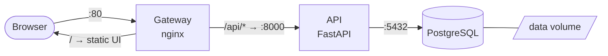

# 1 · The app (~15 min read)

Everything in this lab happens to one small app: a **Task Board**. Three
components, the same three-tier shape as most systems you work on:

> Prettier version: `docs/diagrams/01-app-architecture.drawio`

| Component | What it is | Why it's in the lab |
|-----------|-----------|---------------------|
| **gateway** | nginx: serves the UI, proxies `/api/*` to the API | one entry point; later teaches config management + exposing services |
| **api** | FastAPI, ~100 lines, CRUD on one table | the "your code" tier; later teaches replicas, probes, secrets |
| **db** | official PostgreSQL image | state; later teaches volumes → PersistentVolumeClaims |

## Three things to notice in the code (5 min, do actually look)

1. **`app/api/main.py`** — the API reads its DB connection from **environment
   variables** (`DB_HOST`, `DB_PASSWORD`, …). It has **no retry logic**: if the
   DB isn't reachable at startup, it crashes. Remember this — it's going to
   hurt in Exercise 1 and heal in Exercise 2.
2. **`app/gateway/nginx.conf`** — the gateway forwards to `http://api:8000`.
   Not an IP. Just the name `api`. Who resolves that name is one of the big
   differences between the two exercises.
3. **The API returns `served_by: <hostname>`** in every response, and the UI
   shows it. With one API container it's boring. Keep an eye on it later.

## Where's the data?

PostgreSQL writes to disk. Containers lose their filesystem when they're
removed — so the DB's data directory must live on a **volume** that outlives
the container. Wiring that correctly, twice (Docker, then Kubernetes), is a
main thread of this lab.

Next → [2 · Exercise 1: containers by hand](02-exercise-1-containers.md)
