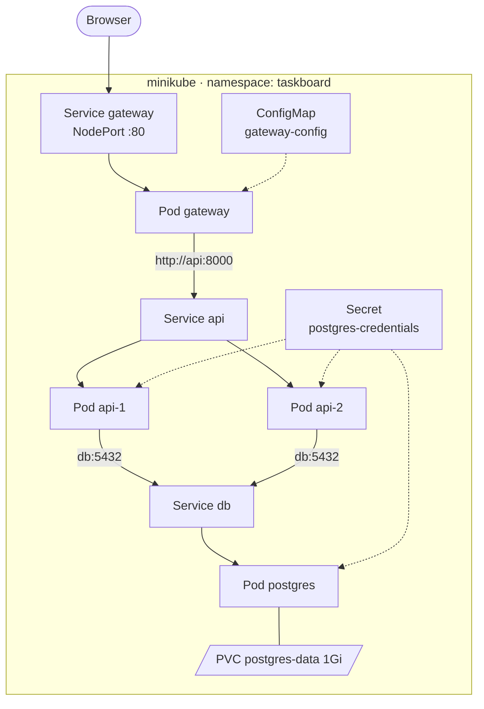

# 3 · Exercise 2 — The Kubernetes way (~2.5 h)

**Goal:** run the exact same app on Kubernetes — same images, same nginx.conf,
same env vars — and watch every Exercise 1 pain get absorbed by the platform.

## 3.1 The idea in one paragraph

In Exercise 1 you issued *commands*: run this, connect that, restart it
yourself. Kubernetes flips the model: you write down the **desired state** in
YAML ("2 API pods, a DB with a 1Gi disk, a gateway reachable on a port") and
hand it to the cluster. Controllers then work forever to make reality match
the file — restarting, rescheduling, rewiring as needed. Your shell history
from Exercise 1 becomes files in `k8s/`, which is why they can live in git,
be reviewed, and be re-applied as the undo button.

Every pain now gets a named answer:

| ⚡ Exercise 1 pain | Kubernetes answer | Object |
|---|---|---|
| #1 startup order, no retries | pods restart until they succeed; readiness gates traffic | restartPolicy, probes |
| #2 wiring in shell history | desired state as YAML, in git | manifests |
| #3 nothing restarts anything | self-healing to the declared replica count | **Deployment** |
| #4 scaling = config surgery | `--replicas=3`; traffic spreads automatically | **Service** |
| #5 state one flag from gone | storage as a declared, named claim | **PVC** |
| (passwords in plain sight) | referenced by name, never inline | **Secret**, **ConfigMap** |

The vocabulary you need today — five words:

- **Pod** — smallest deployable unit; one running instance of a container (≈ what `docker run` gave you). Disposable, gets a random name and IP.
- **Deployment** — "keep N identical pods running, roll out changes gradually."
- **Service** — stable DNS name + load balancing in front of pods. Finds them by **labels**.
- **PersistentVolumeClaim (PVC)** — a named claim on storage that outlives pods.
- **ConfigMap / Secret** — config and credentials as objects, referenced by name.



> Prettier versions: `docs/diagrams/02-containers-vs-k8s.drawio` (the before/after)
> and `docs/diagrams/03-k8s-objects.drawio` (this map).

## 3.2 Start the cluster, load the images

```bash
minikube start
kubectl get nodes                      # 1 node, Ready — this is your "datacenter"
```

Your images exist only in the laptop's Docker; the cluster can't pull them
from any registry. Hand them over:

```bash
minikube image load taskboard-api:v1
minikube image load taskboard-gateway:v1
```

(In real life a CI pipeline pushes to a registry and the cluster pulls. The
manifests mark these `imagePullPolicy: Never` — local images only.)

## 3.3 Apply the manifests — read each one first

The `k8s/` files are numbered in teaching order and heavily commented.
**Open each file, read it, then apply it.** The reading is the exercise.

```bash
kubectl apply -f k8s/00-namespace.yaml
kubectl apply -f k8s/01-postgres-secret.yaml
kubectl apply -f k8s/02-postgres-pvc.yaml
kubectl apply -f k8s/03-postgres-deployment.yaml
kubectl apply -f k8s/04-postgres-service.yaml

kubectl get pods -n taskboard          # postgres Running, 1/1 Ready
kubectl get pvc  -n taskboard          # postgres-data Bound — pain #5, answered
```

Now the API — and a deliberate moment. Apply it and *immediately* watch:

```bash
kubectl apply -f k8s/05-api-deployment.yaml
kubectl get pods -n taskboard -w       # Ctrl-C when stable
```

If postgres wasn't ready yet, you just saw an api pod crash and enter
`CrashLoopBackOff` — the exact Exercise 1 startup-order failure — and then
**fix itself** when the DB came up. Nobody ordered anything. That's pain #1
dying: same crash, different world.

```bash
kubectl apply -f k8s/06-api-service.yaml
kubectl apply -f k8s/07-gateway-configmap.yaml
kubectl apply -f k8s/08-gateway-deployment.yaml
kubectl apply -f k8s/09-gateway-service.yaml

kubectl get all -n taskboard           # the whole app, one view
minikube service gateway -n taskboard  # opens the Task Board in your browser
```

Same app, same UI. Note what you did NOT do: no network create, no volume
create, no ordering, no port juggling, no passwords on the command line.

## 3.4 Collect the payoffs

**Self-healing** (pain #3). Kill the API like it's 2am again:

```bash
kubectl get pods -n taskboard
kubectl delete pod -n taskboard <one-of-the-api-pods>
kubectl get pods -n taskboard          # a replacement is ALREADY there
```

The UI never went down — the Service routed around the dying pod to the other
replica. Compare: in Exercise 1 this was you, awake, running `docker start`.

**Scaling** (pain #4). The thing that needed config surgery:

```bash
kubectl scale deployment api -n taskboard --replicas=5
kubectl get pods -n taskboard
```

Refresh the UI and watch **"served by"** hop across five hostnames. Nobody
touched nginx.conf. Scale back down: `--replicas=2` — connections drain, pods
go. One number, up and down.

**Storage** (pain #5). Delete the *database pod*:

```bash
kubectl delete pod -n taskboard -l app=postgres
kubectl get pods -n taskboard -w       # replacement comes up, Ctrl-C
```

Refresh: your tasks survived. The pod died; the PVC didn't. And there was no
`-v` flag to forget — the claim is part of the declared state.

**Config without rebuilds** (ConfigMap payoff). In Exercise 1, changing nginx
routing meant rebuild + restart. Now:

```bash
kubectl edit configmap gateway-config -n taskboard
#   in the editor: change  proxy_pass http://api:8000/;
#                  to      proxy_pass http://api:8000/tasks;   (deliberately silly)
kubectl rollout restart deployment gateway -n taskboard
```

Refresh — API calls now misbehave. Config change, no image touched. Put it
back (`kubectl edit` again, or `kubectl apply -f k8s/07-gateway-configmap.yaml`
+ another rollout restart).

## 3.5 Where you stand

Everything from Exercise 1, plus healing, scaling, and reviewable config —
for the price of ten readable YAML files. The remaining skill is what to do
when it *doesn't* work, which is a skill, and it's next.

Leave everything running. Exercise 3 breaks this exact installation.

Next → [4 · Exercise 3: troubleshooting](04-exercise-3-troubleshooting.md)
