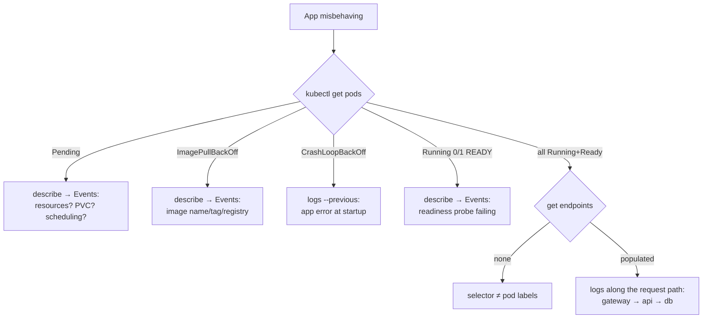

# 4 · Exercise 3 — Troubleshooting (~1.5 h)

**Goal:** learn the diagnosis loop by fixing five real failures. Each scenario
in `troubleshooting/` breaks your running app in a different way; your job is
to find out why and repair it. These five failure modes cover most of what
you'll actually hit in your first year with Kubernetes.

## The loop

Everything starts from the same four commands, in roughly this order:

```bash
kubectl get pods -n taskboard            # 1. what state is everything in?
kubectl describe pod <name> -n taskboard # 2. what does the CLUSTER say? (Events!)
kubectl logs <name> -n taskboard         # 3. what does the APP say? (--previous!)
kubectl get endpoints -n taskboard       # 4. is traffic actually wired to pods?
```

Rules of thumb you'll confirm today:

- `Pending` → the cluster **can't place or satisfy** it → `describe`, read Events.
- `ImagePullBackOff` → the image name/tag/registry is wrong → `describe`.
- `CrashLoopBackOff` → **your app** is exiting → `logs --previous`.
- Everything `Running` but no traffic → `get endpoints` — labels/selectors or readiness.
- `Running` but `0/1 READY` → readiness probe → `describe`, read Events.



## How to run a scenario

```bash
kubectl apply -f troubleshooting/scenario-1/broken.yaml
```

Then diagnose. **Don't open `SOLUTION.md` until you have a theory** — the
struggle is the learning. Each solution walks the full path: symptom →
commands → root cause → fix → the transferable lesson.

The fix is always the same move, and that's deliberate: **re-apply the
known-good manifest from `k8s/`**. Desired state lives in files; files live in
git; recovery is re-applying truth, not patching the cluster by hand.

| # | Apply | You'll practice |
|---|-------|-----------------|
| 1 | `scenario-1/broken.yaml` | reading Events (`ImagePullBackOff`) |
| 2 | `scenario-2/broken.yaml` | reading app logs (`CrashLoopBackOff`, `--previous`) |
| 3 | `scenario-3/broken.yaml` | endpoints & label selectors (all green, still down) |
| 4 | `scenario-4/broken.yaml` | `Pending` and StorageClasses (PVC never binds) |
| 5 | `scenario-5/broken.yaml` | Running ≠ Ready; liveness vs readiness; stuck rollouts |

Do them in order — 3 and 5 build on the instincts from 1 and 2.

## Wrap-up (whole group, ~15 min)

Three questions to close the day:

1. Which Exercise 1 pain did you personally find worst — and which Kubernetes
   object answered it?
2. In scenario 3, every single pod was green and the app was still down.
   What's the general lesson about "is it healthy?" vs "is it wired?"
3. Your real projects: which service would you containerize first, and what
   would its `k8s/` directory contain?

## Clean up

```bash
kubectl delete namespace taskboard   # the whole app, gone in one line
minikube stop                        # or: minikube delete (removes the VM too)
```

## Where to go next

- [Kubernetes Basics](https://kubernetes.io/docs/tutorials/kubernetes-basics/) — official interactive tutorial; good repetition of today
- [Killercoda scenarios](https://killercoda.com/kubernetes) — free browser playgrounds for more reps
- Ingress, Helm, StatefulSets, RBAC — the four topics we deliberately skipped, in the order worth learning them
